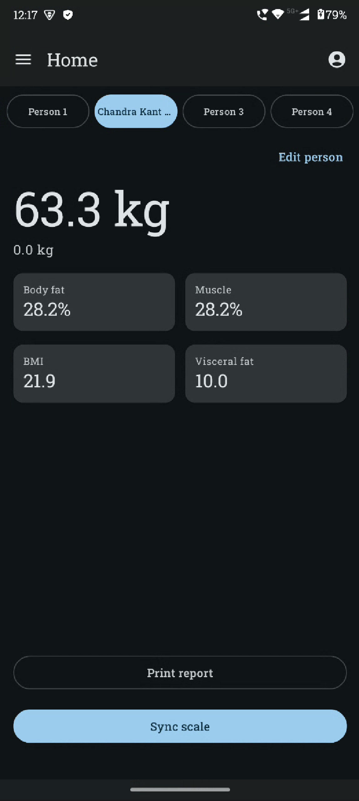
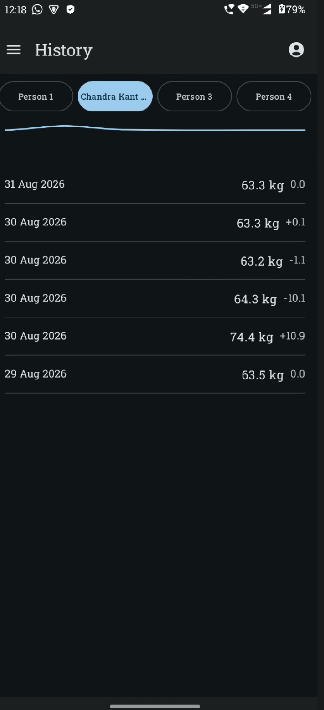
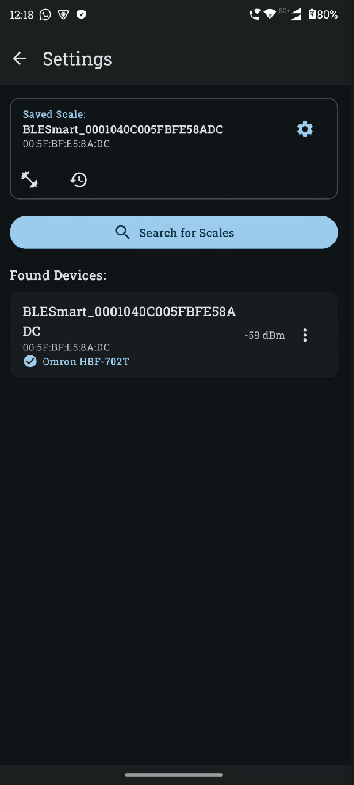
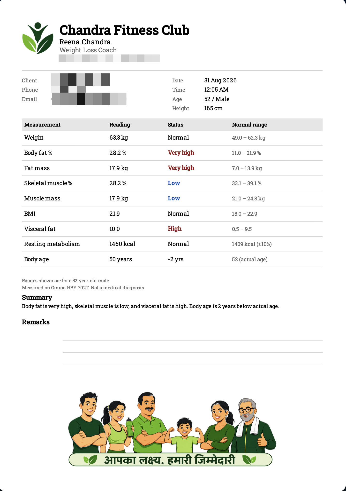

# Chandra Fitness Club coach app (openScale fork)

**This is a fork of [oliexdev/openScale](https://github.com/oliexdev/openScale).** It is **not** the upstream general-purpose scale app.

Som Chandra built this for his mummy, **Reena Chandra**, so she can run **Chandra Fitness Club** without the stock openScale clutter.

This fork is modified for one machine — the **Omron HBF-702T / HBF-702F** body composition scale — and for that practice. It syncs the four people on the scale, shows the latest reading, and prints a client-facing **A4 PDF** with the club name, brand logo, and footer artwork.

Upstream openScale: https://github.com/oliexdev/openScale  
This fork: https://github.com/Somchandra17/openScale-HBF-702F

---

# What this fork does

- Talks only to the Omron HBF-702T (and the identical KRD-703T sibling). Other scales are removed.
- Always shows four people, matching the four user slots on the scale.
- Home / History / Report only. Print or share PDF and CSV from the phone (WhatsApp, Drive, Files, …).
- PDF masthead is **Chandra Fitness Club**, with the club logo top-left. Coach name, phone and email sit under it. Remarks stay at the bottom for handwritten notes.

Install the APK from [Releases](https://github.com/Somchandra17/openScale-HBF-702F/releases), or build it locally (`./build-apk.sh`). Package id stays `com.health.openscale` so a debug build can sit beside a stock openScale install.

# Screenshots

Phone screens are shown at a fixed 180px width so they stay phone-sized on GitHub. The PDF is a document, so it is a little wider.

<table>
  <tr>
    <td align="center" valign="top" width="33%">
       
      Home
    </td>
    <td align="center" valign="top" width="33%">
       
      History
    </td>
    <td align="center" valign="top" width="33%">
       
      Scale
    </td>
  </tr>
</table>

   
  Client PDF (A4)

# What the scale sends

Weight, body fat %, skeletal muscle %, visceral fat, BMI, resting metabolism (BMR), body age, and the weigh-in time. Date of birth, sex and height are **not** in the Bluetooth record — they live in the client profile (Home → Edit person) so the Status column and PDF ranges can be filled in.

# License

This project remains **GPL v3**, same as openScale. Copyright of the original work: olie.xdev. See `LICENSE`.

    Copyright (C) 2025  olie.xdev <olie.xdeveloper@googlemail.com>
    Copyright (C) 2026  Chandra Fitness Club fork contributors

    This program is free software: you can redistribute it and/or modify
    it under the terms of the GNU General Public License as published by
    the Free Software Foundation, either version 3 of the License, or
    (at your option) any later version.

For Bluetooth support, privacy notes, translations and donations related to **upstream** openScale, see [oliexdev/openScale](https://github.com/oliexdev/openScale).
